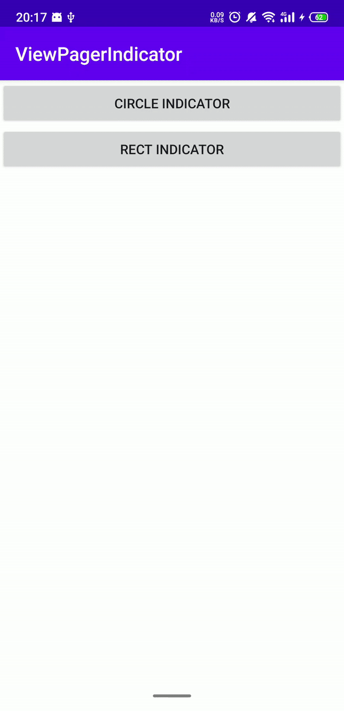
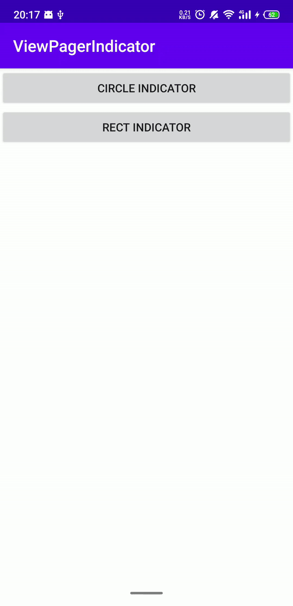

# ViewPagerIndicator
The indicator for Android ViewPager2 and ViewPager.

## Download
```groovy
dependencies {
    implementation 'io.github.vejei.viewpagerindicator:viewpagerindicator:1.0.0-alpha.1'
}
```

## Usage
Add `Indicator` to your layout:
```xml
<androidx.constraintlayout.widget.ConstraintLayout xmlns:android="http://schemas.android.com/apk/res/android"
    xmlns:tools="http://schemas.android.com/tools"
    xmlns:app="http://schemas.android.com/apk/res-auto"
    android:layout_width="match_parent"
    android:layout_height="match_parent"
    android:background="@android:color/white"
    tools:context=".CircleIndicatorFragment">

    <androidx.viewpager2.widget.ViewPager2
        android:id="@+id/view_pager2"
        android:layout_width="match_parent"
        android:layout_height="180dp"
        app:layout_constraintStart_toStartOf="parent"
        app:layout_constraintEnd_toEndOf="parent"
        app:layout_constraintTop_toTopOf="parent"/>

    <io.github.vejei.viewpagerindicator.indicator.CircleIndicator
        android:id="@+id/circle_indicator"
        android:layout_width="wrap_content"
        android:layout_height="wrap_content"
        android:layout_marginTop="16dp"
        app:layout_constraintStart_toStartOf="parent"
        app:layout_constraintEnd_toEndOf="parent"
        app:layout_constraintTop_toBottomOf="@id/view_pager2"
        app:indicatorColor="@android:color/darker_gray"
        app:indicatorSelectedColor="@color/colorAccent"
        app:indicatorGap="8dp"
        app:indicatorRadius="8dp"/>

</androidx.constraintlayout.widget.ConstraintLayout>
```

And setup in your fragment or activity:
```kotlin
PageAdapter pageAdapter = new PageAdapter();
pageAdapter.setData(Arrays.asList(activity.data));
ViewPager2 viewPager2 = view.findViewById(R.id.view_pager2);
viewPager2.setAdapter(pageAdapter);

CircleIndicator circleIndicator = view.findViewById(R.id.circle_indicator);
circleIndicator.setWithViewPager2(viewPager2, false);
circleIndicator.setItemCount(activity.data.length);
circleIndicator.setAnimationMode(CircleIndicator.AnimationMode.SLIDE);
```

## Classes
### `CircleIndicator`
|Method|Description|
|---|---|
|`setWithViewPager2`|Set `ViewPager2` for the indicator. The `userItemCount` parameter indicates whether to use the item count of `ViewPager2`. If the value is true, the indicator use the `ViewPager`'s item count, if it is false, you need to call `setItemCount` every time the adapter's dataset changed, the default value is true. |
|`setWithViewPager`|Set `ViewPager` for the indicator. The `userItemCount` parameter indicates whether to use the item count of `ViewPager`. If the value is true, the indicator use the `ViewPager`'s item count, if it is false, you need to call `setItemCount` every time the adapter's dataset changed, the default value is true.|
|`setAnimationMode`|Set animation used by the indicator.|
|`release`|Unregister the callback or listener of the `ViewPager2`(or `ViewPager`) and the observer of the `ViewPager2`(or `ViewPager`)'s adapter|

Check the `Attributes` section for details of other methods.

### `RectIndicator`
|Method|Description|
|---|---|
|`setWithViewPager2`|Set `ViewPager2` for the indicator. The `userItemCount` parameter indicates whether to use the item count of `ViewPager2`. If the value is true, the indicator use the `ViewPager`'s item count, if it is false, you need to call `setItemCount` every time the adapter's dataset changed, the default value is true. |
|`setWithViewPager`|Set `ViewPager` for the indicator. The `userItemCount` parameter indicates whether to use the item count of `ViewPager`. If the value is true, the indicator use the `ViewPager`'s item count, if it is false, you need to call `setItemCount` every time the adapter's dataset changed, the default value is true.|
|`setAnimationMode`|Set animation used by the indicator.|
|`release`|Unregister the callback or listener of the `ViewPager2`(or `ViewPager`) and the observer of the `ViewPager2`(or `ViewPager`)'s adapter|

Check the `Attributes` section for details of other methods.

## Attributes
#### `CircleIndicator`
|Attribute|Description|Type|Example Value|
| --- |---|---|---|
|`indicatorColor`|The color of unselected items.|Color|`@android:color/darker_gray` or `#ddd`|
|`indicatorSelectedColor`|The color of selected item.|Color|`@color/colorAccent` or `#ffffff`|
|`indicatorGap`|The gap between indicator items.|Dimension|`8dp`|
|`indicatorRadius`|The indicator item radius.|Dimension|`4dp`|
|`indicatorItemCount`|The indicators item count|Integer|`5`|

#### `RectIndicator`
|Attribute|Description|Type|Example Value|
| ------------- |-------------|-------------|-------------|
|`indicatorColor`|The color of unselected items.|Color|`@android:color/darker_gray` or `#ddd`|
|`indicatorSelectedColor`|The color of selected item.|Color|`@color/colorAccent` or `#ffffff`|
|`indicatorGap`|The gap between indicator items.|Dimension|`8dp`|
|`indicatorItemCount`|The indicator item count|Integer|`5`|
|`indicatorWidth`|The width of the rectangle.|Dimension|`24dp`|
|`indicatorHeight`|The height of the rectangle.|Dimension|`4dp`|
|`indicatorCornerRadius`|The rounded radius of the rectangle. radius.|Dimension|`0dp`|

## Screenshots
|`CircleIndicator`|`RectIndicator`|
|---|---|
|||

## Change Log
[Change Log](./CHANGELOG.md)

## License
[MIT](./LICENSE)
